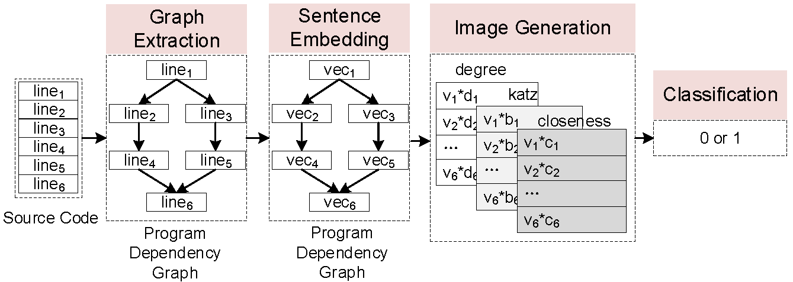

## VulCMS: A Vulnerability Detection System Based on Centrality Analysis and	Multi-Scale Attention

Since deep learning (DL) can automatically learn features from
source code, it has been widely used to detect source code vulnerability. To achieve scalable vulnerability scanning, some prior studies intend to process the source code directly by treating them as
text. To achieve accurate vulnerability detection, other approaches
consider distilling the program semantics into graph representations and using them to detect vulnerability. In practice, text-based
techniques are scalable but not accurate due to the lack of program
semantics. Graph-based methods are accurate but not scalable since
graph analysis is typically time-consuming.

In this paper, we aim to achieve both scalability and accuracy on
scanning large-scale source code vulnerabilities. Inspired by existing DL-based image classification which has the ability to analyze
millions of images accurately, we prefer to use these techniques
to accomplish our purpose. Specifically, we propose a novel idea
that can efficiently convert the source code of a function into an
image while preserving the program details. We implemented VulCMS and tested it on SARD and VulMCI dataset. Experimental results report that
VulCMS can achieve better accuracy than eight state-of-the-art vulnerability detectors (i.e., Checkmarx, FlawFinder, RATS, TokenCNN,
VulDeePecker, SySeVR, VulDeeLocator, and Devign). As for scalability,
VulCMS is about four times faster than VulDeePecker and SySeVR,
about 15 times faster than VulDeeLocator, and about six times faster
than Devign. Furthermore, we conduct a case study on more than 25 million lines of code and the result indicates that VulCMS can
detect large-scale vulnerability. Through the scanning reports, we
finally discover 73 vulnerabilities that are not reported in NVD.

在本文中，我们的目标是实现可扩展性和准确性扫描大规模源代码漏洞。灵感来自现有的基于 DL 的图像分类，该分类具有分析能力数以百万计的图像，我们更喜欢使用这些技术实现我们的目的。具体来说，我们提出了一个新的想法 可以有效地将函数的源代码转换为图像，同时保留程序详细信息。我们实现了 VulCMS，并在SARD和VulMCI数据集上进行测试。实验结果表明 VulCMS 可以达到比八种最先进的漏洞检测器（即 Checkmarx、FlawFinder、RATS、TokenCNN、 VulDeePecker、SySeVR、VulDeeLocator 和 Devign）。至于可扩展性，VulCMS 比 VulDeePecker 和 SySeVR 快四倍，比 VulDeeLocator 快约 15 倍，快约 6 倍 比德维恩。此外，我们对超过 2500 万行代码进行了案例研究，结果表明 VulCMS 可以检测大规模漏洞。通过扫描报告，我们最后发现 NVD 中未报告的 73 个漏洞。

## Design of VulCMS
 

VulCMS consists of four main phases:
Graph Extraction, Sentence Embedding, Image Generation, and
Classification.

VulCMS由四个主要阶段组成： 图提取、句子嵌入、图像生成和 分类。

1. Graph Extraction: Given the source code of a function,
    we first normalize them and then perform static analysis to
    extract the program dependency graph of the function.

图提取：给定函数的源代码，我们首先对它们进行归一化，然后执行静态分析，以提取函数的程序依赖关系图。

2. Sentence Embedding: Each node in the program depen-
    dency graph corresponds to a line of code in the function.
    We regard a line of code as a sentence and embed them into
    a vector.

句子嵌入：程序依赖图中的每个节点对应函数中的一行代码。我们将一行代码视为一个句子，并将其嵌入为向量。

3. Image Generation: After sentence embedding, we apply
    centrality analysis to obtain the importance of all lines of code and multiply them by the vectors one by one. The
    output of this phase is an image.

图像生成：句子嵌入后，我们应用 中心性分析，以获得所有代码行的重要性，并将它们逐个乘以向量。这 此阶段的输出是图像。

4. Classification: Our final phase focuses on classification.
    Given generated images, we first train a CNN model and
    then use it to detect vulnerability.

分类：我们的最后阶段侧重于分类。 给定生成的图像，我们首先训练一个 CNN 模型，然后 然后使用它来检测漏洞

## Dataset
We first collect a dataset from Software Assurance Reference Dataset
(SARD) ( https://samate.nist.gov/SRD/index.php) which is a project maintained by National Institute
of Standards and Technology (NIST) (https://www.nist.gov/). SARD contains a large
number of production, synthetic（合成）, and academic security flaws or vulnerabilities (i.e., bad functions) and many good functions. In our
paper, we focus on detecting vulnerability in C/C++, therefore, we
only select functions written in C/C++ in SARD. Data obtained
from SARD consists of 12,303 vulnerable functions and 21,057
non-vulnerable functions. 

我们首先从软件保障参考数据集中收集数据集（萨德）(https://samate.nist.gov/SRD/index.php), 这是国家研究所维护的一个项目标准与技术（NIST）(https://www.nist.gov/). SARD 包含一个大 生产、合成和学术安全缺陷或漏洞（即不良功能）的数量以及许多良好的功能。在我们的 论文中，我们专注于检测 C/C++ 中的漏洞，因此，我们 仅选择在 SARD 中用 C/C++ 编写的函数。获得的数据 来自 SARD 的 12,303 个易受攻击的函数和 21,057个不易受攻击的功能。

Moreover, we also conducted tests on the VulMCI dataset.

此外，我们还在VulMCI数据集上进行了测试。

## Source Code

#### Step 1: Code normalization

第 1 步：代码规范化

Normalize the code with normalization.py (This operation will overwrite the data file, please <font color="red">make a backup(做备份)</font>)

用 normalization.py 规范化代码（此操作会覆盖数据文件，请做备份）

```
python ./normalization.py -i ./data/sard
```
#### Step 2: Generate PDGs with the help of joern

第 2 步：在 joern 的帮助下生成 PDG

Prepare the environment refering to: [joern](https://github.com/joernio/joern) you can try the version between 1.1.995 to 1.1.1125

准备环境参考： [joern](https://github.com/joernio/joern) 您可以尝试 1.1.995 到 1.1.1125 之间的版本

```powershell
# first generate .bin files
python joern_graph_gen.py  -i ./data/sard/Vul -o ./data/sard/bins/Vul -t parse
python joern_graph_gen.py  -i ./data/sard/No-Vul -o ./data/sard/bins/No-Vul -t parse

#使用下面的全局路径进行 生成.bon files
python joern_graph_gen.py  -i /mnt/f/Code/VulCMS/VulCMS/data/sard/Vul -o /mnt/f/Code/VulCMS/VulCMS/data/sard/bins/Vul -t parse

# then generate pdgs (.dot files)
python joern_graph_gen.py  -i ./data/sard/bins/Vul -o ./data/sard/pdgs/Vul -t export -r pdg
python joern_graph_gen.py  -i ./data/sard/bins/Vul -o ./data/sard/pdgs/No-Vul -t export -r pdg

#全局路径
python joern_graph_gen.py  -i /mnt/f/Code/VulCMS/VulCMS/data/sard/bins/Vul -o /mnt/f/Code/VulCMS/VulCMS/data/sard/pdgs/Vul -t export -r pdg
python joern_graph_gen.py  -i /mnt/f/Code/VulCMS/VulCMS/data/sard/bins/No-Vul -o /mnt/f/Code/VulCMS/VulCMS/data/sard/pdgs/No-Vul -t export -r pdg
```
#### Step 3: Train a UniXcoder model

步骤 3：训练 UniXcoder 模型

```
./fasttext UniXcoder -input ./data/data.txt -output ./data/data_model -minCount 8 -dim 128 -epoch 9 -lr 0.2 -wordNgrams 2 -loss ns -neg 10 -thread 20 -t 0.000005 -dropoutK 4 -minCountLabel 20 -bucket 4000000 -maxVocabSize 750000 -numCheckPoints 10
```

#### Step 4: Generate images from the pdgs

第 4 步：从 PDGs 生成图像

Generate Images from the pdgs with ImageGeneration.py, this step will output a .pkl file for each .dot file.

使用 ImageGeneration.py 从 PDGs 生成图像，此步骤将为每个 .dot 文件输出一个 .pkl 文件。

```
python ImageGeneration.py -i ./data/sard/pdgs/Vul -o ./data/sard/outputs/Vul -m ./data/data_model.bin
python ImageGeneration.py -i ./data/sard/pdgs/No-Vul -o ./data/sard/outputs/No-Vul  -m ./data/data_model.bin

#全局地址
python ImageGeneration.py -i /mnt/f/Code/VulCMS/VulCMS/data/sard/pdgs/Vul -o /mnt/f/Code/VulCMS/VulCMS/data/sard/outputs/Vul -m /mnt/f/Code/VulCMS/VulCMS/data/data_model.bin
python ImageGeneration.py -i /mnt/f/Code/VulCMS/VulCMS/data/sard/pdgs/No-Vul -o /mnt/f/Code/VulCMS/VulCMS/data/sard/outputs/No-Vul  -m /mnt/f/Code/VulCMS/VulCMS/data/data_model.bin
```
#### Step 5: Integrate the data and divide the training and testing datasets

第 5 步：整合数据并划分训练和测试数据集

Integrate the data and divide the training and testing datasets with generate_train_test_data.py, this step will output a train.pkl and a test.pkl file.

集成数据，用generate_train_test_data.py划分训练和测试数据集，此步骤将输出 train.pkl 和 test.pkl 文件。

```powershell
# n denotes the number of kfold, i.e., n=10 then the training set and test set are divided according to 9:1 and 10 sets of experiments will be performed
python generate_train_test_data.py -i ./data/sard/outputs -o ./data/sard/pkl -n 5
```
#### Step 6: Train with CNN

第 6 步：使用 CNN 进行培训

```
python VulCMS.py -i ./data/sard/pkl
```


